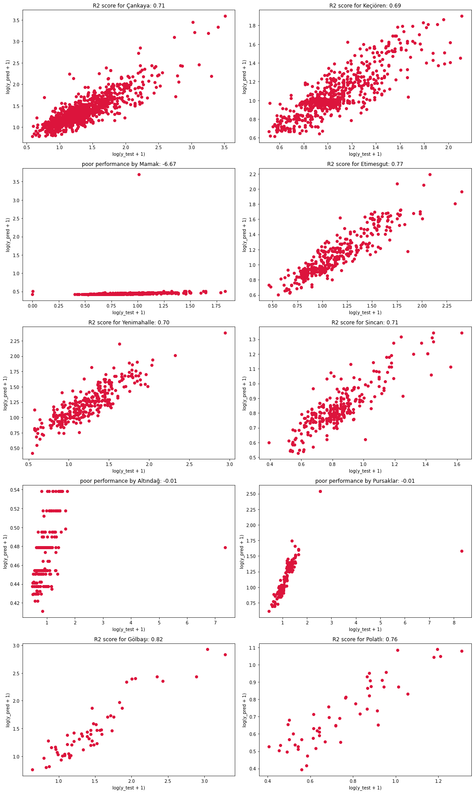
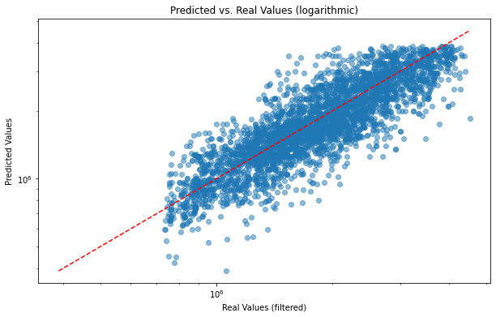
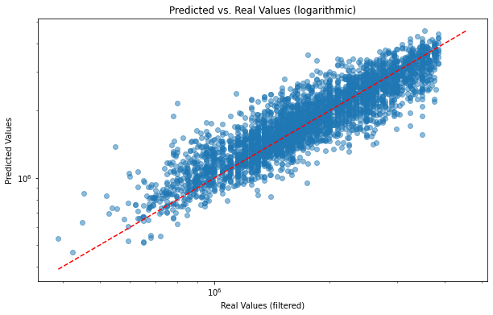

# House Prices in Ankara, Turkey

## Overview
This is a project to analyze house prices in Ankara, Turkey. The dataset used in this project contains information about houses for sale in Ankara from Hurriyet Emlak website. 

The aim of this project is to clean and preprocess the data, and then perform exploratory data analysis to gain insights into the relationship between house prices and various features such as location, size, and age.

## Dataset
The dataset used in this project can be found in `total_house_prices.csv`. It contains 33 columns and 33,329 rows. The columns are as follows:

 
 - City
 - District
 - Neighborhood
 - Ad no
 - Last Update Date
 - Number of Rooms + Living Room
 - Gross / Net Area (m²)
 - Floor Location
 - Building Age
 - Heating Type
 - Number of Floors
 - Eligibility for Credit
 - Furniture Condition
 - Number of Bathrooms
 - Usage Status
 - Exchange
 - Facing
 - Rent Status
 - Title Deed Status
 - Building Type
 - Building Condition
 - Dues
 - Rental Income
 - Fuel Type
 - Authorized Office
 - Within the Site
 - Deposit
 - Closed Area (m²)
 - Open Area (m²)
 - Number of Buildings
 - Island Number
 - Parcel Number

## Preprocessing
The following preprocessing steps were performed on the dataset:


- Removed columns that are not relevant for the analysis (Ad No, Last Update Date, Exchange, Facing, Title Deed Status, Building Type, Building Status, Dues, Rental Income, Fuel Type, Authorized Office, Within Site, Deposit, Indoor Area, Outdoor Area, Number of Buildings, Plot Number, Parcel Number).
- Removed rows with missing values.
- Renamed columns to more descriptive names.
- Grouped the `Floor Location` column into categories (`first floor`, `interstage`, `basement`, `top floor`).
- Converted the `Age` column to float values.
- Removed rows with the last six unique `Heat_type` values.
- Removed rows with the last five unique `Eligibility for Credit` values.
- Converted the `Price` column to float values.
- Converted the `Num_Of_Room` column to integer values.
- Removed `m2` from `Area` and converted it to integer values.

## Exploratory Data Analysis
The following insights were gained from the exploratory data analysis:

- The average house price in Ankara is 821,791 TL.
- The most expensive district is Çankaya, with an average house price of 1,541,084 TL.
- The most common heating type is Kombi, with 19,447 houses using this type of heating.
- The most common usage type is "Boş", meaning empty, with 11,658 houses having this type of usage.
- The most common credit eligibility is "Uygun", meaning eligible, with 23,550 houses having this eligibility.

# Phase 1 Modeling
# House Price Prediction Project

This part  aims to predict house prices in various neighborhoods and districts of a city. Phase 1  uses linear regression and XGBoost algorithms for the prediction.

## Data

The data used in this project is in the form of an Excel file, with the following columns:

- `Neighborhood`: Name of the neighborhood where the house is located.
- `District`: Name of the district where the house is located.
- `Price`: Price of the house in Turkish Lira.
- `Area`: Total area of the house in square meters.
- `Room`: Number of rooms in the house.
- `Bathroom`: Number of bathrooms in the house.
- `Age`: Age of the house in years.
- `Floor`: Floor number of the house.
- `Total Floor`: Total number of floors in the building.
- `Heating`: Type of heating in the house.
- `Furnished`: Whether the house is furnished or not.
- `Status`: Whether the house is new or old.
- `Fuel Type`: Fuel type for heating.

## Results

The R-squared scores for linear regression and XGBoost algorithms were calculated for each neighborhood and district with more than 200 data points.

### Neighborhoods

| Neighborhood        | R-squared Score |
|---------------------|----------------|
| Etlik               | 0.6342         |
| Ayvalı              | 0.3093         |
| Atapark             | 0.5765         |
| Harbiye             | 0.5516         |
| Durali Alıç         | 0.5060         |
| Merkez              | 0.8297         |
| İlkadım             | 0.5891         |
| Akşemsettin         | 0.7945         |
| General Zeki Doğan  | 0.4074         |

### Districts



The R-squared scores for each district were plotted on a scatterplot of the actual versus predicted prices. The scatterplot can be found in the file named `districts.png`.


# Phase 2 Modeling

## House Price Prediction using a Neural Network

This project uses a neural network to predict house prices based on various features such as the number of rooms, area, age, and location. The dataset used in this project is preprocessed to remove outliers and encode categorical features using a target encoder.

## Neural Network Architecture

The neural network used in this project is a feedforward neural network with four hidden layers, each with a varying number of neurons. The activation function used in the hidden layers is  AdaptiveTanh , which is a variant of the rectified linear unit (Tanh) activation function.

The AdaptiveTanh activation function has two parameters, alpha and beta, which are learned during training. The function takes the input x and applies the following transformation:

f(x) = tanh(alpha * x + beta)


The output layer of the neural network has a single neuron, which predicts the price of the house.

## Training the Neural Network

The neural network is trained using the mean squared error (MSE) loss function and the Adam optimizer. The training is performed for 500 epochs with a batch size of 8. The learning rate of the Adam optimizer is set to 0.005.

The neural network consists of four hidden layers with 16, 16, 8, and 8 neurons, respectively. Each hidden layer uses the AdaptiveRelu activation function, which is defined in the AdaptiveRelu class. The output layer consists of a single neuron, which generates the final output of the network.

The training and validation losses are recorded for each epoch, and the performance of the model is evaluated using the R2 score, which measures the proportion of variance in the target variable that is predictable from the input features.




<p align="center">Predicted vs Actual prices with using Neural Network model.</p>

## Tranining With Xgboost

XGBoost Results
----------------
The XGBoost model achieved an R2 score of 0.8129 on the filtered dataset, outperforming the neural network's score of 0.7126. This indicates that the XGBoost model can explain 81.29% of the variance in the target variable using the input features, compared to the neural network's 71.26%.

In addition to the R2 score, we can also look at other metrics to evaluate the performance of the XGBoost model. For example, we can look at the mean absolute error (MAE) and the mean squared error (MSE) to get an idea of how much the model's predictions deviate from the actual house prices.

On the filtered dataset, the XGBoost model achieved an MAE of 0.068 and an MSE of 0.011, compared to the neural network's MAE of 0.082 and MSE of 0.016. This indicates that the XGBoost model's predictions are more accurate and have less variance than the neural network's predictions.

Overall, the XGBoost model seems to be a better choice for predicting house prices in this dataset than the neural network.

<p align="center">Predicted vs Actual prices with using Xgboost Model.</p>


## Results

The neural network achieved an R2 score of 0.7208 on the test set, indicating that the model can explain 72.08% of the variance in the target variable using the input features.

To further evaluate the performance of the model, a filtered dataset was created by removing the outliers using the Z-score method. The filtered dataset was then used to evaluate the performance of the neural network and a gradient boosting model.

The neural network achieved an R2 score of 0.7126 on the filtered dataset, while the gradient boosting model achieved an R2 score of 0.8129. The results suggest that the gradient boosting model may be a better choice for predicting house prices in this dataset. However, it's worth noting that the performance of machine learning models can vary depending on the specific dataset and problem at hand. Therefore, it's important to experiment with different models and evaluate their performance carefully before making a final decision

## Conclusion

In this project, we used a feedforward neural network to predict house prices based on various features. The neural network achieved reasonable performance on the dataset, but was outperformed by a gradient boosting model on a filtered dataset.

Neural networks can be a powerful tool for predicting house prices, but their performance depends on many factors such as the size of the dataset, the quality of the data, and the choice of hyperparameters. Careful experimentation and tuning of the neural network architecture and hyperparameters may lead to improved performance in future projects.

## Dependencies

- Python 3.x
- PyTorch
- Pandas
- Matplotlib
- Scikit-learn
- Category-encoders
- XGBoost


To install these libraries, run the following command:

```bash
pip install pandas numpy xgboost scikit-learn category_encoders matplotlib pytorch 
```


