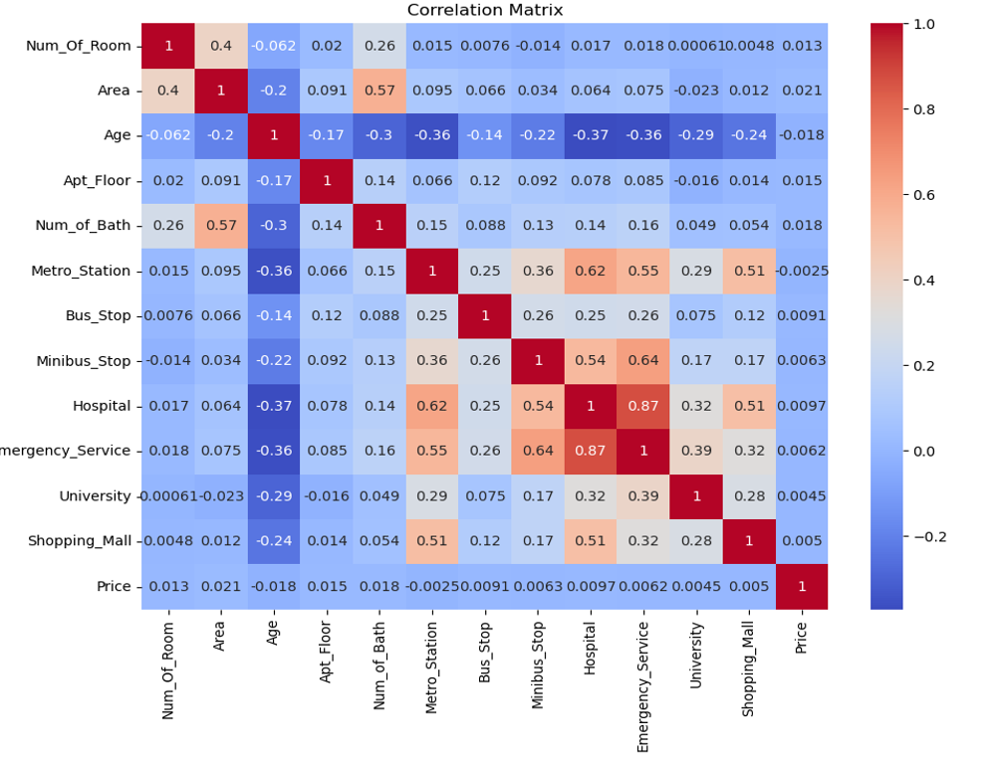
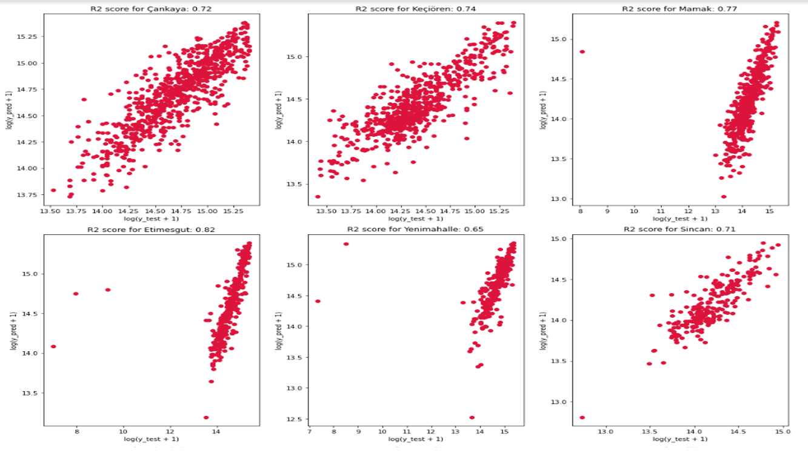

# HepsiEmlak-Web-Scrapping-and-Modeling
To download and test the model  : https://drive.google.com/file/d/1Uo0am49JUeGSQTaO5kkrhrVFibgJ98Mf/view?usp=sharing

## DATA WITHOUT DISTANCE FEATURES

This section presents a comprehensive analysis of our project on house price prediction in Ankara using regression techniques, neural Network, and extreme gradient boosting with a specific focus on comparing the models results through the utilization of Minitab and Python. Moreover, we presented the overall model results that encompassed data from all districts, enabling a comprehensive understanding of the housing market in Ankara.

By employing this software, we aim to reinforce the credibility and consistency of our results, instilling confidence in the accuracy of our house price predictions in Ankara. With Minitab, we seek to mitigate potential biases or inaccuracies, thus ensuring the validity and robustness of our conclusions.

The process begins with web scraping data from the website "Hepsiemlak" to gather information about houses listed for sale. A total of 1,400 pages were scraped, resulting in the collection of 33,000 houses. The collected features include city, district, neighborhood, listing number, update date, room and living room count, area, floor number, age of the building, heating type, rental income, fuel type, authorized office, presence in a residential complex, deposit, covered area, open area, number of buildings, plot number, and more.

To prepare the data for modeling, irrelevant and empty features were removed, leaving the following remaining features: district, neighborhood, number of rooms, area, floor number, age, heating type, apartment floor, credit eligibility, presence of items, number of bathrooms, usage, and price.

The correlation of features should be checked because correlation analysis helps identify features that are highly correlated with each other. Having highly correlated features in a predictive model can introduce multicollinearity, which can impact the model's stability and interpretability. By identifying such features, you can choose to remove or consolidate them, reducing complexity and improving the model's performance. Also, correlation analysis helps in feature selection by identifying features that are highly correlated with the target variable. Highly correlated features are generally more informative and have a stronger relationship with the target variable, making them valuable for prediction. Conversely, features with low correlation may not contribute significantly to the model's predictive power and can be excluded.The correlation map for the features can be seen in Figure 1.

As it can be guessed, the area, the number of bathroom, and the number of floor is highly correlated for the final part, the correlation results will be considered for the feature selection.

Next, the distribution of the features was examined, and a filtering process was applied using the interquartile range (IQR) method. The lower and upper bounds were calculated based on the first quartile (Q1) and third quartile (Q3). Data points outside this range were filtered out, ensuring a more representative dataset for modeling.

Categorical features were encoded to convert them into numerical representations suitable for machine learning algorithms.

## DATA WITH DISTANCE FEATURES

This part presents a detailed analysis of a house price prediction model that utilizes distance features collected from the website "Hepsiemlak.com". Initially, the distance features were gathered, which proved to be a time-consuming task due to the dynamic HTML structure. However, through automation, the information was successfully collected over a period of 1.5 weeks. The collected data comprised various features, including district, neighborhood, number of rooms, area, age, heat type, apartment floor, credit eligibility, items, number of bathrooms, and distances to important locations such as metro stations, bus stops, hospitals, emergency services, universities, and shopping malls.

Upon examining the dataset, several correlations between the features have been observed. These correlations provide insights into the relationships and dependencies among the variables, shedding light on how they interact and influence each other.

By exploring these correlations and understanding the relationships between the features, it becomes possible to gain valuable insights into the dataset. These insights can inform decision-making processes, aid in feature selection, and contribute to the overall understanding of the factors influencing house prices in the given context.

The data was then filtered using the lower and upper bounds of the interquartile range to eliminate outliers. Then the distribution of the numerical data is again inspected.

## Results

### DATA WITHOUT DISTANCE FEATURES

#### Neural Network Implementation

After training the neural network model, the following results were obtained:

R-squared score: 0.6778

The neural network model achieved an R-squared score of 0.6778, indicating that it explains approximately 67.78% of the variability in the target variable. While there is room for improvement, this result suggests that our neural network model captures a substantial portion of the underlying patterns in the data.

#### Extreme Gradient Boosting

To further improve the predictive performance, the XG Boost algorithm was applied. XG Boost is a powerful gradient boosting technique that iteratively improves the prediction model.

Hyperparameter tuning was performed to find the best combination of parameters for the XG Boost model. GridSearchCV was employed to perform an exhaustive search over the hyperparameter space. The model was evaluated using negative mean squared error as the scoring metric. The best model obtained from the grid search was then trained and evaluated on the training and testing sets.

The final result after applying XG Boost was as follows:

To gain insights into the importance of the features, feature importance analysis was conducted. A graph depicting the feature importances was generated, revealing the relative significance of each feature in predicting house prices.

Moreover, a district-wise analysis was performed to assess the success of the XG Boost model in predicting house prices across different districts. A graph illustrating the performance of the model for each district was generated, providing valuable information on the model's accuracy across various geographical areas.

The results demonstrated the effectiveness of the models in capturing the underlying patterns and making accurate predictions. However, because the distance features are not included, the overall success of the model can be improved.

### DATA WITH DISTANCE FEATURES

We have incorporated distance information into our house price prediction model to account for the impact of location and proximity on property values. By collecting precise distance measurements between locations, we aim to improve the accuracy of our predictions and gain valuable insights into the factors influencing house prices.

#### Extreme Gradient Boosting

To build an accurate model, Cat Boost, a machine learning algorithm, was employed instead of neural networks due to its superior performance. Cat Boost is an ensemble learning method that belongs to the gradient boosting family, similar to XG Boost. However, Cat Boost incorporates additional features such as handling categorical variables more efficiently and automatically applying the optimal learning rate. By tuning the hyperparameters, the results are shown below.

After the results, the importance of the features is examined. This part will be helpful for the interface of the model.

Considering the practicality of deploying the model in an interface for users to input their preferences and obtain predicted house prices, the number of features was reduced to 12, focusing on the most influential factors. Despite the reduction in the feature set, the revised model exhibited a high R2 score of 0.8784, implying that it maintained a significant level of accuracy in capturing the underlying patterns and trends in house prices.

## Interface

We have developed a user-friendly interface that allows individuals to efficiently utilize our advanced predictive model. This powerful tool leverages 12 key inputs to provide accurate and valuable predictions. These inputs include the area of the property, the neighborhood it is located in, the age of the building, the floor level, the district it belongs to, proximity to universities, shopping malls, and metro stations, the number of rooms and bathrooms, and the type of heating system. By leveraging this comprehensive set of factors, our model generates highly reliable predictions for various real estate scenarios. Whether you are a buyer, seller, or investor, our interface empowers you to make informed decisions by harnessing the power of data and cutting-edge technology. Stay ahead in the dynamic real estate market with our intuitive and efficient interface, offering you unparalleled insights and predictions.

The analysis presented in this part showcased the process of building a house price prediction model using distance features. The model successfully utilized the collected data, underwent feature selection, and employed the Cat Boost algorithm to achieve accurate predictions. The model's high R2 score and low MSE validate its effectiveness in estimating house prices based on key factors. The developed interface provides users with a practical means of obtaining predicted house prices, contributing to informed decision-making in the real estate market.
